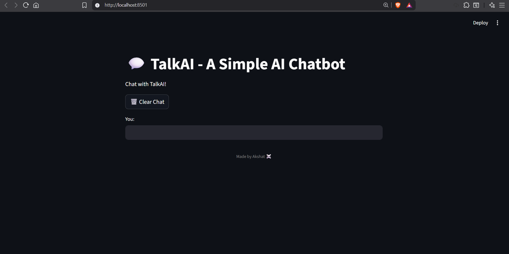
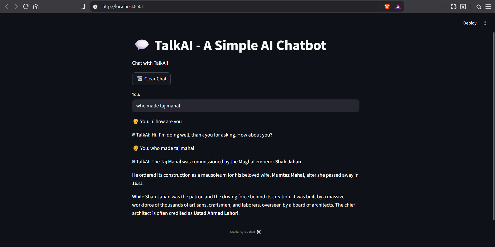

# 🤖 TalkAI - Streamlit Chatbot using Google Gemini API

TalkAI is a simple AI chatbot built in **Python** using **Streamlit** and the **Google Gemini API**.  
It provides a clean web-based interface to chat with an AI model and view responses in real time.

---

## 🚀 Features
- 💬 Interactive chat interface built with Streamlit  
- 🔄 Keeps chat history during the session  
- 🧠 Uses Google's Gemini model for AI-generated responses  
- ⚙️ Simple to set up and run locally  
- 🪶 Lightweight and fast  

---

## 🧩 Tech Stack
- **Python 3.8+**  
- **Streamlit**  
- **Google Gemini API**  
- **Time Module**

---

## 🛠️ Setup Instructions

### 1️⃣ Clone this repository

git clone https://github.com/Akshat03-ai/TalkAI.git

cd TalkAI

### 2️⃣ Install dependencies

pip install requirements.txt

### 3️⃣ Add your API Key

Open talkai.py in any editor.

Find this line:

API_KEY = "insert_your_api_key_here"

Replace "insert_your_api_key_here" with your actual Google Gemini API key.

### 4️⃣ Run the app

streamlit run talkai.py

### 5️⃣ Open the app

After running the command, Streamlit will show a local URL (usually):

http://localhost:8501

Open it in your browser to start chatting with TalkAI!

### 🖼️ Screenshots

## 🧩 Chat UI

This is the main interface where users can chat with TalkAI.

  

## 💬 Chat Response

Here's TalkAI responding to a user query.

  

## 💡 Future Improvements

🧠 Add model selection (e.g., choose between Gemini 1.5, 2.0, etc.)

🎨 Add dark/light mode toggle

🎤 Integrate speech input/output

💾 Save chat history locally